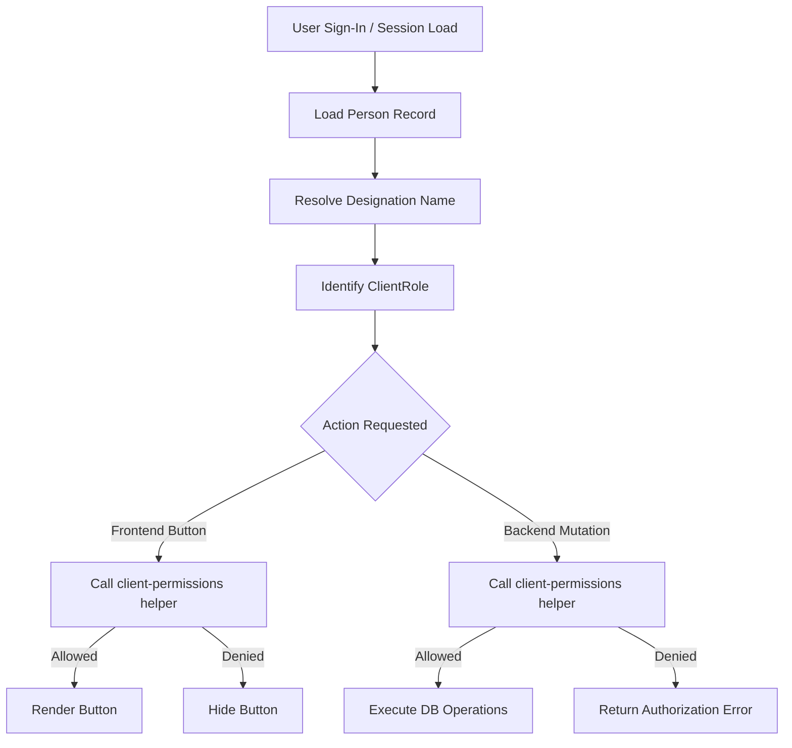

# Client Master Authorization Architecture

This document describes the centralized authorization system designed and built for the **Client Master** module of VNC Hub. It serves as a permanent reference for developers maintaining, extending, or replicating this system.

---

## 1. Architecture Overview

VNC Hub uses a **centralized, database-driven role-based access control (RBAC)** architecture. 
Instead of computing roles dynamically or relying on fragile string searches of emails, departments, or designations across different files, the system enforces a **Single Source of Truth** pattern.

### The Lifecycle of a Request:
1. **User Sign-In / Load**: The user signs in and is authenticated. The backend loads their `Person` record from the `people` table.
2. **Designation Mapping**: The user's role is determined strictly from their database-backed `designation` (linked via `designation_id` in Drizzle/Postgres).
3. **Helpers Validation**: Both the frontend views and backend mutations import the same helpers from `@/lib/client-permissions.ts`.
4. **Frontend Action / UI**: Buttons (e.g., *Edit*, *Approve*, *Submit*) are conditionally shown or hidden using the helpers.
5. **Backend Mutation Gatekeeping**: When an API endpoint is hit, the mutation calls the corresponding helper with the current session context. If unauthorized, it immediately terminates and returns a typed validation error.



---

## 2. File Responsibilities

Below is the layout of the authorization system:

### 📂 File Structure:
```
src/
 ├── lib/
 │    ├── client-permissions.ts     <-- Central Source of Truth (helpers)
 │    ├── client-visibility.ts      <-- Backward compatibility layer
 │    └── hierarchy.ts              <-- Basic Person interfaces
 ├── api/
 │    └── clients.mutations.ts      <-- Backend mutations protected by helpers
 └── routes/
      ├── clients.tsx               <-- Main client list (Create/Edit/TL buttons)
      ├── client-approvals.tsx      <-- Approval queue (Approve/Reject buttons)
      └── client-change-requests.tsx <-- Change requests (New request/Review buttons)
```

### 1. `src/lib/client-permissions.ts`
- **Purpose**: Centralized storage of RBAC rules. Holds the core logic mapping roles to business logic actions.
- **Exposed Functions**:
  - `getClientRole(user)`: Resolves the 10 roles from `user.designation`.
  - `canCreateClient(user)`
  - `canEditClient(user, client)`
  - `canEditCompanyInformation(user, client)`
  - `canSubmitClient(user, client)`
  - `canReviewClientApproval(user, client)`
  - `canRaiseChangeRequest(user, client)`
  - `canApproveChangeRequest(user, client)`
  - `canAssignTeamLead(user, client)`
  - `canManageDeliveryTeam(user, client)`
  - `canViewClient(user, client)`
  - `canOpenClient360(user, client)`
  - `canViewCommercialInformation(user)`

### 2. `src/lib/client-visibility.ts`
- **Purpose**: Provides backward compatibility. Overwritten to import, delegate to, and re-export permissions logic from `client-permissions.ts`. It acts as the bridge for older module components.

### 3. `src/api/clients.mutations.ts`
- **Purpose**: Implements the server-side endpoints for client operations. Checks permissions before executing SQL updates/inserts.

### 4. `src/routes/clients.tsx`
- **Purpose**: List view of client records, incorporating sheet forms for drafts. Checks client-level permission helpers to show or hide the *Edit*, *Submit*, *Assign Team Lead*, and *Manage Team* actions.

---

## 3. Function Documentation

Here are the central helper functions:

| Function | Purpose | Parameters | Return | Used In (Frontend) | Used In (Backend) |
| :--- | :--- | :--- | :--- | :--- | :--- |
| `canCreateClient` | Verifies client creation rights. | `user: Person` | `boolean` | Create Client button | `addClientFn` |
| `canEditClient` | Verifies general edit rights. | `user, client` | `boolean` | Form display check | `setClientAccountsFn`, `setClientContactsFn`, `setClientSoftwareStackFn` |
| `canEditCompanyInformation` | Verifies company info edits (allows BU Head edit). | `user, client` | `boolean` | Edit button | `updateClientFn` |
| `canSubmitClient` | Verifies record submission rights. | `user, client` | `boolean` | Submit button | `submitClientForReviewFn` |
| `canReviewClientApproval` | Verifies Approve/Reject/Send Back. | `user, client` | `boolean` | Approval row actions | `decideClientApprovalFn` |
| `canAssignTeamLead` | Verifies Team Lead assignment. | `user, client` | `boolean` | Assign TL button | `assignClientTeamOwnershipFn` (TL field) |
| `canManageDeliveryTeam` | Verifies delivery team modifications. | `user, client` | `boolean` | Manage Team button | `assignClientTeamOwnershipFn` (delivery team fields) |
| `canViewClient` | Filters list visible records. | `user, client` | `boolean` | Client table filtering | Queries bootstrap |
| `canViewCommercialInformation` | Masks sensitive monetary fields. | `user` | `boolean` | Commercial tab locks | Bootstrapped client maps |

---

## 4. Developer Extension Guide

### How to add a new role (e.g. `Regional Head`):
1. In `src/lib/client-permissions.ts`, add the type name to `ClientRole`:
   ```typescript
   export type ClientRole = ... | "Regional Head";
   ```
2. Update the designation map in `getClientRole(user)`:
   ```typescript
   if (desig === "Regional Head") return "Regional Head";
   ```
3. Update the desired helper functions (e.g. if Regional Head is allowed to view and approve):
   ```typescript
   export function canReviewClientApproval(user: Person | null, client: ClientRecord | null): boolean {
     const role = getClientRole(user);
     if (role === "Regional Head") return true;
     // existing logic ...
   }
   ```

### How to reuse this system for new modules (e.g. `Projects` or `Invoices`):
1. Create a `src/lib/project-permissions.ts` file.
2. Import `getClientRole(user)` from `client-permissions.ts`.
3. Export module-specific functions such as `canCreateProject(user)` or `canViewInvoice(user, invoice)` using the mapped role:
   ```typescript
   import { getClientRole } from "./client-permissions";
   
   export function canCreateProject(user: Person | null): boolean {
     const role = getClientRole(user);
     return role === "CEO" || role === "Administrator (IT)" || role === "Business Unit Head";
   }
   ```

---

## 5. Central Safety Rules

These rules must **NEVER** be broken or bypassed:
- **Finance Head & Marketing Head** are the ONLY roles allowed to create clients.
- **Business Unit Head** is the ONLY role allowed to approve clients or assign the Team Lead.
- **Team Lead** can only manage their own delivery team. They cannot change the Team Lead assignment.
- **Backend API gates are mandatory**. Hiding buttons on the UI is for UX only; mutations must throw authorization errors if hit directly by unauthorized actors.
